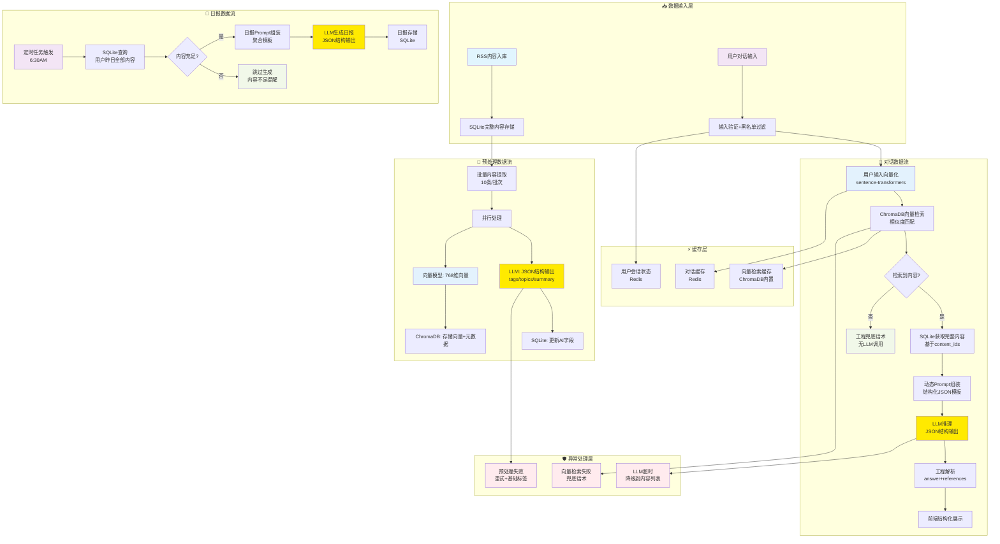
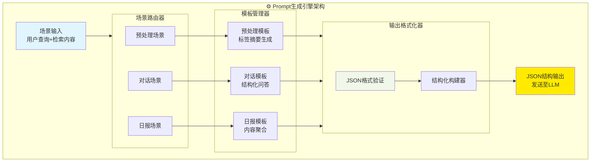

# RSS智能订阅器 - AI服务架构规范

## 📋 文档信息

| 项目 | 内容 |
|------|------|
| **文档版本** | v1.0 |
| **创建日期** | 2024-12-19 |
| **最后更新** | 2024-12-19 |
| **文档状态** | 设计阶段 |
| **负责人** | 开发团队 |

## 🎯 概述

RSS智能订阅器AI服务架构旨在为用户提供智能内容预处理、个性化日报生成和智能对话服务。本架构基于本地化部署，确保数据安全和成本控制，通过多层安全防护和直接语义检索，提供可靠的AI增强功能。

### 核心目标

- **智能内容预处理**：自动生成标签、主题、摘要
- **个性化日报**：基于用户订阅内容生成每日报告
- **智能对话**：基于RAG架构的内容问答系统
- **安全可控**：多层防护，避免恶意利用
- **本地化部署**：零API成本，数据不出本地

## 🏗️ 系统架构

### 系统架构总览

  ```mermaid
  graph TB
      %% 数据输入层
      subgraph Input ["📥 数据输入层"]
          RSS["RSS内容入库"]
          UserQuery["用户对话请求"]
          Schedule["定时任务触发"]
      end
      
      %% AI处理核心
      subgraph AICore ["🧠 AI处理核心"]
          PreProcessor["AI预处理服务<br/>标签摘要生成"]
          ConversationEngine["对话处理引擎<br/>向量检索+智能回答"]
          ReportGenerator["日报生成器<br/>内容聚合+摘要"]
          PromptEngine["Prompt生成引擎<br/>三场景统一管理"]
      end
      
      %% AI模型层
      subgraph Models ["🤖 AI模型层"]
          LLM["Qwen2.5-7B-Instruct<br/>本地部署"]
          VectorModel["Sentence Transformers<br/>768维向量"]
      end
      
      %% 安全和性能层
      subgraph Security ["🛡️ 安全与性能层"]
          SecurityFilter["安全过滤器<br/>黑名单+注入检测"]
          PerformanceManager["性能管理器<br/>缓存+并发+监控"]
          FallbackHandler["兜底处理器<br/>异常场景处理"]
      end
      
      %% 存储层
      subgraph Storage ["💾 存储层"]
          SQLite[("SQLite数据库<br/>内容+AI数据")]
          ChromaDB[("ChromaDB向量库<br/>语义检索")]
          Cache[("Redis缓存<br/>对话+会话")]
      end
      
      %% 配置层
      subgraph Config ["⚙️ 配置层"]
          TemplateLib["模板库<br/>Prompt模板管理"]
          BlacklistLib["黑名单库<br/>安全规则配置"]
          ConfigManager["配置管理器<br/>系统参数调优"]
      end
      
      %% 主要数据流
      RSS --> PreProcessor
      UserQuery --> ConversationEngine
      Schedule --> ReportGenerator
      
      PreProcessor --> PromptEngine
      ConversationEngine --> PromptEngine
      ReportGenerator --> PromptEngine
      
      PromptEngine --> LLM
      PreProcessor --> VectorModel
      ConversationEngine --> VectorModel
      
      %% 安全和性能连接
      ConversationEngine --> SecurityFilter
      SecurityFilter --> PerformanceManager
      PerformanceManager --> FallbackHandler
      
      %% 存储连接
      PreProcessor --> SQLite
      PreProcessor --> ChromaDB
      ConversationEngine --> ChromaDB
      ConversationEngine --> SQLite
      ReportGenerator --> SQLite
      PerformanceManager --> Cache
      
      %% 配置连接
      PromptEngine --> TemplateLib
      SecurityFilter --> BlacklistLib
      AICore --> ConfigManager
      
      %% 样式定义
      style RSS fill:#e1f5fe
      style UserQuery fill:#f3e5f5
      style Schedule fill:#f3e5f5
      style LLM fill:#ffea00
      style VectorModel fill:#e3f2fd
      style PromptEngine fill:#fff3e0
      style SecurityFilter fill:#ffebee
      style FallbackHandler fill:#f1f8e9
      style SQLite fill:#e8f5e8
      style ChromaDB fill:#e8f5e8
      style Cache fill:#e8f5e8
  ```

### 详细处理流程

  ```mermaid
  graph LR
      subgraph Preprocessing ["🔄 预处理流程"]
          A1["RSS内容"] --> A2["批量提取10条"]
          A2 --> A3["并行处理"]
          A3 --> A4["LLM生成标签摘要"]
          A3 --> A5["向量化768维"]
          A4 --> A6["存储SQLite"]
          A5 --> A7["存储ChromaDB"]
      end
      
      subgraph Conversation ["💬 对话流程"]
          B1["用户输入"] --> B2["安全过滤"]
          B2 --> B3["向量化查询"]
          B3 --> B4["检索相关内容"]
          B4 --> B5{"找到内容?"}
          B5 -->|是| B6["生成Prompt"]
          B5 -->|否| B7["兜底话术"]
          B6 --> B8["LLM推理"]
          B8 --> B9["结构化输出"]
      end
      
      subgraph DailyReport ["📰 日报流程"]
          C1["定时6:30AM"] --> C2["聚合昨日内容"]
          C2 --> C3{"内容足够?"}
          C3 -->|是| C4["生成日报Prompt"]
          C3 -->|否| C5["跳过生成"]
          C4 --> C6["LLM生成日报"]
          C6 --> C7["存储日报"]
      end
      
      style A4 fill:#ffea00
      style A5 fill:#e3f2fd
      style B8 fill:#ffea00
      style B7 fill:#f1f8e9
      style C6 fill:#ffea00
      style C5 fill:#f1f8e9
  ```

### 技术选型

| 组件 | 技术选择 | 说明 |
|------|----------|------|
| **LLM模型** | Qwen2.5-7B-Instruct | 适配M1 MacBook Pro，模型大小约4GB，JSON结构输出 |
| **向量模型** | sentence-transformers | paraphrase-multilingual-MiniLM-L12-v2，768维向量 |
| **向量数据库** | ChromaDB | 本地化部署，支持相似度搜索和元数据过滤 |
| **标准数据库** | SQLite | 存储完整内容信息，支持AI生成字段 |
| **缓存系统** | Redis | 对话缓存、会话状态管理，可选组件 |
| **黑名单过滤** | 正则表达式 + 关键词库 | 敏感词检测、Prompt注入攻击防护 |
| **任务调度** | APScheduler | 与现有调度器集成，支持AI定时任务 |
| **性能监控** | 自研轻量级监控 | 响应时间追踪、模型调用统计 |

### 数据流架构



## 🧠 核心组件设计

### 1. AI预处理服务

**功能**：对新入库的RSS内容进行智能预处理
**调用场景**：预处理（定时触发6:00AM）
**输出格式**：JSON结构化数据

```python
class AIPreprocessingService:
    async def daily_preprocessing_task(self):
        """每日预处理任务"""
        # 1. 获取待处理内容 (批量10条)
        # 2. 并行处理：LLM生成+向量化
        # 3. LLM生成JSON格式标签/主题/摘要
        # 4. 向量化内容 (768维)
        # 5. 存储到SQLite和ChromaDB
        # 6. 异常处理：重试机制+基础标签兜底
        
    async def process_content_batch(self, contents: List[RSSContent]) -> List[ProcessedContent]:
        """批量处理内容"""
        try:
            # 并行调用LLM和向量模型
            llm_results = await self.llm_service.generate_tags_summary_batch(contents)
            vectors = await self.vector_service.encode_batch([c.title + c.description for c in contents])
            
            return self._combine_results(contents, llm_results, vectors)
        except Exception as e:
            # 兜底策略：基础规则生成标签
            return await self._fallback_processing(contents)
```

### 2. 黑名单过滤服务

**功能**：多层安全防护，避免恶意利用
**过滤层级**：输入层、处理层、输出层

```python
class BlacklistFilterService:
    def __init__(self):
        self.sensitive_patterns = self._load_sensitive_patterns()
        self.injection_patterns = self._load_injection_patterns()
    
    def filter_user_input(self, user_input: str) -> FilterResult:
        """用户输入过滤"""
        # 1. 敏感词检测
        # 2. Prompt注入攻击检测
        # 3. 输入长度和格式检查
        # 4. 返回过滤结果和建议
        
    def filter_llm_output(self, output: str, original_query: str) -> str:
        """LLM输出过滤"""
        # 1. 敏感内容审查
        # 2. 格式化输出
        # 3. 内容合规检查
```

### 3. 场景化向量检索服务

**功能**：根据不同场景进行智能内容检索
**支持场景**：对话检索、日报聚合

```python
class VectorRetrievalService:
    async def retrieve_for_conversation(self, user_query: str, user_id: int) -> List[RetrievedContent]:
        """对话场景的向量检索"""
        # 1. 用户输入向量化
        query_vector = await self.embedder.encode(user_query)
        
        # 2. ChromaDB相似度检索 (仅该用户内容)
        results = await self.chroma_client.query(
            query_embeddings=[query_vector],
            where={"user_id": user_id},
            n_results=5,
            include=['metadatas', 'distances']
        )
        
        # 3. 相似度阈值过滤 (>0.6)
        # 4. SQLite获取完整内容信息
        return await self._build_retrieved_contents(results)
    
    async def retrieve_for_daily_report(self, user_id: int) -> List[RSSContent]:
        """日报场景的内容聚合"""
        # 获取用户昨日全部内容，按时间排序
        yesterday = datetime.now() - timedelta(days=1)
        return await self.content_service.get_user_contents_by_date(user_id, yesterday)
```

### 4. Prompt生成引擎

**核心设计**：统一的Prompt管理器，支持三种场景的模板生成和JSON结构化输出



#### 场景化模板设计

| 场景 | 触发方式 | 输入数据 | 输出格式 | 示例用途 |
|------|----------|----------|----------|----------|
| **预处理** | 定时6:00AM | RSS原始内容 | `{"tags": [], "topics": [], "summary": ""}` | 内容智能标记 |
| **对话** | 用户查询 | 用户问题+检索内容 | `{"answer": "", "references": []}` | 智能问答 |
| **日报** | 定时6:30AM | 用户昨日内容 | `{"title": "", "content": "", "highlights": []}` | 内容聚合 |

#### 核心实现代码

```python
class UnifiedPromptEngine:
    """统一的Prompt生成引擎，管理三种场景的模板生成"""
    
    def __init__(self):
        self.template_manager = TemplateManager()
        self.scenario_router = ScenarioRouter()
        self.output_formatter = OutputFormatter()
    
    async def generate_prompt(self, scenario: str, **kwargs) -> Optional[str]:
        """统一的Prompt生成入口"""
        
        # 1. 场景路由
        scenario_type = self.scenario_router.route(scenario, **kwargs)
        if not scenario_type:
            return None
            
        # 2. 模板选择和生成
        template = await self.template_manager.get_template(scenario_type)
        raw_prompt = template.format(**kwargs)
        
        # 3. JSON格式化和验证
        structured_prompt = self.output_formatter.format_json_prompt(
            raw_prompt, scenario_type
        )
        
        return structured_prompt
    
    # 场景特定方法
    async def generate_preprocessing_prompt(self, content: RSSContent) -> str:
        """预处理场景：生成内容标签和摘要"""
        return await self.generate_prompt("preprocessing", content=content)
    
    async def generate_conversation_prompt(self, user_query: str, contents: List[RetrievedContent]) -> Optional[str]:
        """对话场景：基于检索内容回答用户问题"""
        if not contents:
            return None  # 无内容时不生成Prompt，由工程兜底
            
        return await self.generate_prompt(
            "conversation", 
            user_query=user_query, 
            retrieved_contents=contents
        )
    
    async def generate_daily_report_prompt(self, user_contents: List[RSSContent], date: str) -> str:
        """日报场景：聚合用户内容生成日报"""
        return await self.generate_prompt(
            "daily_report",
            contents=user_contents,
            date=date
        )

class TemplateManager:
    """模板管理器：负责各场景的模板管理"""
    
    PREPROCESSING_TEMPLATE = '''
    请分析以下RSS内容，生成标签、主题和摘要，严格按JSON格式返回：
    
    标题：{title}
    内容：{description}
    
    返回格式：
    {{
        "tags": ["标签1", "标签2", "标签3"],
        "topics": ["主题1", "主题2"], 
        "summary": "简洁的内容摘要...",
        "content_type": "video|article|news"
    }}
    '''
    
    CONVERSATION_TEMPLATE = '''
    基于用户订阅的以下内容回答问题，必须返回JSON格式：
    
    用户问题：{user_query}
    
    相关内容：
    {content_list}
    
    返回格式：
    {{
        "answer": "基于您的订阅内容的详细回答...",
        "references": [
            {{"content_id": 123, "title": "内容标题", "snippet": "相关片段", "relevance": 0.9}}
        ],
        "confidence": 0.8,
        "suggestion": "进一步的建议或相关话题"
    }}
    '''
    
    DAILY_REPORT_TEMPLATE = '''
    基于用户{date}的订阅内容，生成个性化日报：
    
    内容列表：
    {content_summary}
    
    返回格式：
    {{
        "title": "📰 {date} 个人资讯日报",
        "content": "## 今日要闻\n\n详细的日报内容...",
        "highlights": ["重点1", "重点2", "重点3"],
        "main_topics": ["主要话题1", "主要话题2"],
        "content_count": {content_count},
        "reading_time": "预计阅读时间5分钟"
    }}
    '''
```

### 5. 异常处理和兜底机制

**功能**：确保系统稳定性和用户体验

```python
class FallbackHandler:
    async def handle_no_content_found(self, user_query: str, user_id: int) -> ConversationResponse:
        """处理检索不到内容的情况"""
        # 1. 分析用户历史偏好
        user_tags = await self.get_user_frequent_tags(user_id)
        
        # 2. 生成智能建议
        suggestions = self._generate_content_suggestions(user_query, user_tags)
        
        return ConversationResponse(
            success=True,
            answer=f"抱歉，没有找到相关内容。{suggestions}",
            is_fallback=True
        )
    
    async def handle_llm_timeout(self, retrieved_contents: List[RetrievedContent]) -> ConversationResponse:
        """处理LLM超时的降级策略"""
        # 降级到简单的内容列表展示
        return ConversationResponse(
            success=True,
            answer="找到相关内容，但AI分析超时，为您展示相关内容列表：",
            content_list=retrieved_contents,
            is_degraded=True
        )
```


## 📊 API接口设计

### 数据模型定义

```python
from pydantic import BaseModel
from typing import List, Optional
from datetime import datetime

class ConversationRequest(BaseModel):
    query: str                           # 用户输入查询
    user_id: int                         # 用户ID
    enable_cross_user: bool = False      # 是否开启跨用户推荐(暂时不实现)

class ContentReference(BaseModel):
    content_id: int                      # 内容ID
    title: str                           # 内容标题
    url: str                             # 内容链接
    platform: str                        # 平台来源
    snippet: str                         # 引用片段
    relevance_score: float               # 相关度分数

class ConversationResponse(BaseModel):
    success: bool                        # 请求是否成功
    answer: str                          # AI生成的回答文本
    referenced_contents: List[ContentReference] = []  # 引用的内容列表
    has_links: bool                      # 是否包含链接
    response_type: str                   # 响应类型: "ai_generated" | "fallback" | "degraded"
    processing_time: float               # 处理时间(毫秒)
    is_cached: bool = False              # 是否来自缓存

class DailyReportResponse(BaseModel):
    success: bool                        # 生成是否成功
    date: str                            # 日报日期 "2024-12-19"
    content: str                         # 日报内容(Markdown格式)
    content_count: int                   # 聚合的内容数量
    generated_at: datetime               # 生成时间
    topics: List[str] = []               # 主要话题
```

### 对话接口

```python
@router.post("/api/v1/ai/conversation")
async def ai_conversation(request: ConversationRequest):
    """AI智能对话接口 - 完全工程侧包装，用户不直接与LLM交互"""
    
    try:
        # Step 1: 输入验证和黑名单过滤
        filter_result = blacklist_service.filter_user_input(request.query)
        if not filter_result.is_safe:
            return ConversationResponse(
                success=False,
                answer="输入内容包含不当信息，请重新输入。",
                response_type="blocked"
            )
        
        # Step 2: 用户输入向量化
        query_vector = await embedding_service.encode(request.query)
        
        # Step 3: 向量检索相关内容
        retrieved_contents = await vector_service.retrieve_for_conversation(
            user_query=request.query,
            user_id=request.user_id
        )
        
        # Step 4: 检查是否有相关内容
        if not retrieved_contents:
            # 工程兜底策略，不调用LLM
            fallback_message = await fallback_handler.handle_no_content_found(
                request.query, request.user_id
            )
            return ConversationResponse(
                success=True,
                answer=fallback_message,
                response_type="fallback"
            )
        
        # Step 5: 生成结构化Prompt
        prompt = await prompt_engine.generate_conversation_prompt(
            request.query, retrieved_contents
        )
        
        # Step 6: LLM推理 (JSON结构化输出)
        try:
            llm_response = await llm_service.generate_with_timeout(
                prompt=prompt,
                timeout_seconds=10,
                response_format="json"
            )
            
            # Step 7: 解析LLM的JSON输出
            parsed_response = json.loads(llm_response)
            
            # Step 8: 工程侧包装最终响应
            return ConversationResponse(
                success=True,
                answer=parsed_response["answer"],
                referenced_contents=[
                    ContentReference(**ref) for ref in parsed_response.get("references", [])
                ],
                has_links=len(parsed_response.get("references", [])) > 0,
                response_type="ai_generated",
                processing_time=response_time
            )
            
        except asyncio.TimeoutError:
            # LLM超时，降级处理
            return await fallback_handler.handle_llm_timeout(retrieved_contents)
            
    except Exception as e:
        logger.error(f"AI对话服务异常: {e}")
        return ConversationResponse(
            success=False,
            answer="服务暂时不可用，请稍后重试。",
            response_type="error"
        )
```

### 日报接口

```python
@router.get("/api/v1/ai/daily-report/{user_id}/{date}")
async def get_daily_report(user_id: int, date: str):
    """获取用户每日AI报告"""
    
    try:
        # Step 1: 验证日期格式和用户权限
        report_date = datetime.strptime(date, "%Y-%m-%d").date()
        
        # Step 2: 获取用户当日内容
        user_contents = await content_service.get_user_contents_by_date(
            user_id=user_id,
            target_date=report_date
        )
        
        # Step 3: 检查内容数量是否足够生成日报
        if len(user_contents) < 3:
            return DailyReportResponse(
                success=True,
                date=date,
                content="📰 今日内容较少，暂未生成AI日报。\n\n建议检查订阅配置或手动拉取内容。",
                content_count=len(user_contents),
                generated_at=datetime.now(),
                response_type="insufficient_content"
            )
        
        # Step 4: 生成日报Prompt
        prompt = await prompt_engine.generate_daily_report_prompt(
            user_contents=user_contents,
            user_id=user_id,
            date=date
        )
        
        # Step 5: LLM生成日报 (JSON结构化输出)
        llm_response = await llm_service.generate_daily_report(
            prompt=prompt,
            response_format="json"
        )
        
        parsed_report = json.loads(llm_response)
        
        return DailyReportResponse(
            success=True,
            date=date,
            content=parsed_report["content"],
            content_count=len(user_contents),
            generated_at=datetime.now(),
            topics=parsed_report.get("main_topics", [])
        )
        
    except Exception as e:
        logger.error(f"日报生成异常: {e}")
        return DailyReportResponse(
            success=False,
            date=date,
            content="日报生成失败，请稍后重试。",
            content_count=0,
            generated_at=datetime.now()
        )
```

### 性能监控接口

```python
@router.get("/api/v1/ai/metrics")
async def get_ai_metrics():
    """获取AI服务性能指标"""
    return {
        "llm_model_status": "healthy",           # LLM模型状态
        "average_response_time": 1.2,           # 平均响应时间(秒)
        "daily_conversation_count": 156,        # 今日对话次数
        "cache_hit_rate": 0.35,                 # 缓存命中率
        "fallback_rate": 0.08,                  # 兜底响应比例
        "vector_db_size": "2.1GB",              # 向量数据库大小
        "preprocessing_queue": 23               # 预处理队列长度
    }
```

## ⚙️ 配置管理

```python
AI_CONFIG = {
    "llm": {
        "model_name": "Qwen/Qwen2.5-7B-Instruct",
        "model_path": "./models/qwen2.5-7b-instruct",  # 本地模型路径
        "max_tokens": 2048,
        "temperature": 0.7,
        "timeout_seconds": 10,                          # LLM推理超时时间
        "max_concurrent_requests": 3,                   # 最大并发请求数
        "response_format": "json"                       # 强制JSON输出格式
    },
    "embedding": {
        "model_name": "paraphrase-multilingual-MiniLM-L12-v2",
        "vector_dimension": 768,
        "batch_size": 32,                               # 向量化批处理大小
        "normalize_embeddings": True                    # 是否归一化向量
    },
    "vector_db": {
        "chroma_persist_directory": "./data/chroma_db", # ChromaDB存储路径
        "collection_name": "rss_contents",              # 集合名称
        "similarity_threshold": 0.6,                    # 相似度阈值
        "max_results": 5                                # 最大检索结果数
    },
    "preprocessing": {
        "schedule": "0 6 * * *",                        # 每日6:00AM
        "batch_size": 10,                               # 批处理大小
        "max_retries": 3,                               # 最大重试次数
        "retry_delay": 60,                              # 重试延迟(秒)
        "fallback_tags": ["内容", "信息", "资讯"]        # 兜底标签
    },
    "daily_report": {
        "schedule": "30 6 * * *",                       # 每日6:30AM
        "min_content_count": 3,                         # 最少内容数量
        "max_content_count": 50,                        # 最多内容数量
        "report_format": "markdown"                     # 日报格式
    },
    "conversation": {
        "max_query_length": 500,                        # 最大查询长度
        "cache_ttl": 3600,                              # 缓存生存时间(秒)
        "enable_cache": True,                           # 是否启用缓存
        "fallback_messages": {                          # 兜底话术配置
            "no_content": "抱歉，在您的订阅内容中没有找到相关信息。建议您：\n1. 尝试其他关键词\n2. 检查订阅配置\n3. 手动拉取最新内容",
            "timeout": "AI分析超时，为您展示相关内容列表：",
            "error": "服务暂时不可用，请稍后重试。"
        }
    },
    "security": {
        "enable_blacklist": True,                       # 启用黑名单过滤
        "blacklist_file": "./config/blacklist.json",   # 黑名单文件路径
        "max_requests_per_minute": 30,                  # 每分钟最大请求数
        "enable_rate_limit": True                       # 启用限流
    },
    "performance": {
        "enable_monitoring": True,                      # 启用性能监控
        "log_slow_queries": True,                       # 记录慢查询
        "slow_query_threshold": 2.0,                    # 慢查询阈值(秒)
        "metrics_collection_interval": 300             # 指标收集间隔(秒)
    }
}
```

### 黑名单配置文件示例

```json
// config/blacklist.json
{
    "sensitive_keywords": [
        "政治敏感词",
        "暴力内容",
        "色情内容"
    ],
    "injection_patterns": [
        "ignore.*previous.*instructions",
        "forget.*system.*prompt",
        "你是.*助手.*现在.*扮演",
        "请忘记.*之前.*规则"
    ],
    "blocked_domains": [
        "malicious-site.com"
    ]
}
```

## 🔧 与现有系统集成

### 调度器集成

```python
# app/main.py
class AIScheduler:
    def __init__(self):
        self.scheduler = AsyncIOScheduler()
        self.preprocessing_service = AIPreprocessingService()
        self.report_service = DailyReportService()
    
    def setup_jobs(self):
        """设置AI相关定时任务"""
        # AI预处理任务
        self.scheduler.add_job(
            self.preprocessing_service.daily_preprocessing_task,
            'cron', hour=6, minute=0
        )
        
        # 日报生成任务
        self.scheduler.add_job(
            self.report_service.generate_all_user_reports,
            'cron', hour=6, minute=30
        )

# 在main.py中集成
ai_scheduler = AIScheduler()
ai_scheduler.setup_jobs()
```

### 前端集成

现有的对话卡片组件已经准备就绪，只需要连接后端API：

```typescript
// 前端调用示例
const response = await fetch('/api/v1/ai/conversation', {
  method: 'POST',
  body: JSON.stringify({ question: userInput })
});
```

## 🎯 实施计划

### Phase 1: 基础AI预处理 (Week 1-2)
- [ ] 本地LLM服务部署 (Qwen2.5-7B)
- [ ] 向量化服务实现 (sentence-transformers)
- [ ] ChromaDB向量数据库集成
- [ ] 基础预处理调度器
- [ ] 重试机制和兜底策略

### Phase 2: 意图识别与过滤 (Week 3)
- [ ] 关键词正则意图识别
- [ ] 黑名单过滤器实现
- [ ] 基础安全防护测试
- [ ] 性能基准测试

### Phase 3: Prompt生成引擎 (Week 4)
- [ ] 向量库圈选规则实现
- [ ] Prompt模板库建设
- [ ] 动态Prompt组装器
- [ ] 三种场景模板验证

### Phase 4: 对话与日报服务 (Week 5-6)
- [ ] 对话API接口开发
- [ ] 日报生成服务实现
- [ ] 输出过滤优化
- [ ] 前端集成测试

### Phase 5: 监控与优化 (Week 7)
- [ ] 性能监控系统
- [ ] 用户反馈收集
- [ ] 模型效果优化
- [ ] 生产环境部署

## 📈 预期效果

### 性能指标
- **意图识别准确率**: >85% (正则实现)
- **内容检索相关性**: >80% (向量相似度)
- **系统响应时间**: <2秒 (对话), <30秒 (日报)

### 安全指标
- **黑名单拦截率**: >99%
- **内容范围控制**: 100% (仅基于用户订阅)

### 用户体验指标
- **对话成功率**: >90%
- **日报阅读完成率**: >70%

## 🔄 后续优化方向

### 短期优化 (1-3个月)
- BERT意图识别升级
- 用户反馈机制
- 模板个性化支持

### 中期拓展 (3-6个月)
- 多模态内容支持
- 智能推荐系统
- 内容聚类分析

### 长期愿景 (6-12个月)
- 模型微调
- 知识图谱构建
- 实时分析能力

---

**文档状态**: 设计完成，准备开始实施  
**下一步**: 开始Phase 1的基础AI预处理功能开发