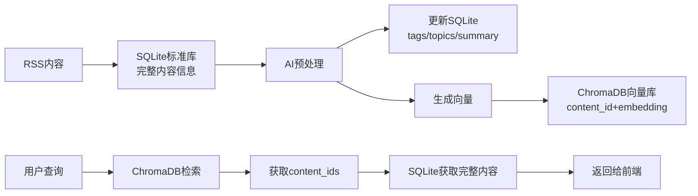

# RSS智能订阅器 - AI服务架构规范

## 📋 文档信息

| 项目 | 内容 |
|------|------|
| **文档版本** | v1.0 |
| **创建日期** | 2024-12-19 |
| **最后更新** | 2024-12-19 |
| **文档状态** | 设计阶段 |
| **负责人** | 开发团队 |

## 🎯 概述

RSS智能订阅器AI服务架构旨在为用户提供智能内容预处理、个性化日报生成和智能对话服务。本架构基于本地化部署，确保数据安全和成本控制，通过多层安全防护和智能意图识别，提供可靠的AI增强功能。

### 核心目标

- **智能内容预处理**：自动生成标签、主题、摘要
- **个性化日报**：基于用户订阅内容生成每日报告
- **智能对话**：基于RAG架构的内容问答系统
- **安全可控**：多层防护，避免恶意利用
- **本地化部署**：零API成本，数据不出本地

## 🏗️ 系统架构

### 架构概览

  ```mermaid
  graph TD
      A["RSS内容入库"] --> B["内容预处理队列"]
      
      subgraph "AI预处理链路（独立）"
          C["定时预处理任务<br/>(每日6:00AM)"] --> D["获取待处理内容"]
          D --> E["批量处理引擎<br/>(10条/批次)"]
          
          E --> F["LLM模型<br/>(Qwen2.5-7B)"]
          E --> G["向量模型<br/>(sentence-transformers)"]
          
          F --> H["生成标签/主题/摘要"]
          G --> I["生成向量嵌入<br/>(768维向量)"]
          
          H --> J["更新SQLite标准库"]
          I --> K["存储ChromaDB向量库"]
      end
      
      B --> C
      
      subgraph "AI服务链路"
          L["用户对话请求"] --> M["意图识别引擎"]
          P["定时日报任务<br/>(每日6:30AM)"] --> Q["用户内容聚合"]
          
          M --> N["黑名单过滤器"]
          N --> O["Prompt生成引擎"]
          Q --> O
          
          subgraph "Prompt生成引擎核心"
              O --> R["向量库圈选规则"]
              R --> S["Prompt模板选择器"]
              S --> T["动态Prompt组装器"]
          end
          
          T --> U["LLM模型"]
          U --> V["输出过滤器"]
          V --> W["结果输出"]
      end
      
      subgraph "模板库系统"
          X1["黑名单模板库"]
          X2["基于主题的对话模板库"]
          X3["日报模板库"]
          X4["通用模板库"]
          X5["向量检索规则库"]
      end
      
      subgraph "存储系统"
          Y1[("SQLite标准库<br/>(完整内容+AI生成数据)")]
          Y2[("ChromaDB向量库<br/>(向量+元数据)")]
      end
      
      J --> Y1
      K --> Y2
      
      Y2 --> R
      X1 --> N
      X2 --> S
      X3 --> S
      X4 --> S
      X5 --> R
      
      style C fill:#e1f5fe
      style L fill:#f3e5f5
      style P fill:#f3e5f5
      style O fill:#fff3e0
      style F fill:#ffea00
      style G fill:#ffea00
      style T fill:#81c784
      style U fill:#ffea00
      style Y1 fill:#e8f5e8
      style Y2 fill:#e8f5e8
  ```

### 技术选型

| 组件 | 技术选择 | 说明 |
|------|----------|------|
| **LLM模型** | Qwen2.5-7B-Instruct | 适配M1 MacBook Pro，模型大小约4GB |
| **向量模型** | sentence-transformers | paraphrase-multilingual-MiniLM-L12-v2 |
| **向量数据库** | ChromaDB | 本地化部署，支持相似度搜索 |
| **标准数据库** | SQLite | 存储完整内容信息 |
| **意图识别** | 关键词正则 + 轻量BERT | 前期正则实现，后期升级BERT |
| **任务调度** | APScheduler | 与现有调度器集成 |

### 数据流架构



## 🧠 核心组件设计

### 1. AI预处理服务

**功能**：对新入库的RSS内容进行智能预处理
**调用场景**：预处理（定时触发）
**Prompt模板**：预处理默认模板

```python
class AIPreprocessingService:
    async def daily_preprocessing_task(self):
        """每日预处理任务"""
        # 1. 获取待处理内容
        # 2. 批量处理（10条/批次）
        # 3. LLM生成标签/主题/摘要
        # 4. 向量化内容
        # 5. 存储到SQLite和ChromaDB
        # 6. 重试机制和兜底策略
```

### 2. 意图识别引擎

**功能**：分析用户输入，识别查询意图
**支持意图类型**：
- 内容查询
- 摘要请求  
- 推荐需求
- 特定主题查询

```python
class IntentRecognitionService:
    def analyze_user_intent(self, question: str, user_id: int) -> dict:
        """分析用户意图"""
        return {
            "intent_type": "content_query",
            "topics": ["AI", "技术"],
            "tags": ["机器学习", "深度学习"],
            "content_ids": [],
            "is_recommendation": False,
            "confidence": 0.8
        }
```

### 3. Prompt生成引擎

**核心设计**：三种调用场景，各有独立的处理链路

#### 场景1：预处理场景
- **触发**：定时任务（每日6:00AM）
- **目标**：生成标签、主题、摘要
- **Prompt模板**：预处理默认模板
- **无需检索**：直接处理原始内容

#### 场景2：对话场景  
- **触发**：用户主动询问
- **目标**：基于用户订阅内容回答问题
- **Prompt模板**：对话模板（科技/金融/通用）
- **检索规则**：基于意图的向量检索

#### 场景3：日报场景
- **触发**：定时任务（每日6:30AM）
- **目标**：生成个性化日报
- **Prompt模板**：日报模板
- **检索规则**：聚合用户昨日内容

```python
class PromptGenerationEngine:
    async def generate_prompt(self, intent: dict, user_id: int, service_type: str) -> str:
        """生成Prompt"""
        if service_type == "preprocessing":
            return await self._generate_preprocessing_prompt(content)
        elif service_type == "conversation":
            return await self._generate_conversation_prompt(intent, user_id)
        elif service_type == "daily_report":
            return await self._generate_daily_report_prompt(user_id)
```

### 4. 向量库圈选服务

**功能**：根据不同场景的检索规则，从向量库中选择相关内容

```python
class VectorSelectorService:
    async def get_contents_by_intent(self, user_id: int, intent: dict) -> list:
        """基于意图获取内容"""
        # 1. 标签精确匹配
        # 2. 主题相关匹配
        # 3. 向量相似度搜索
        # 4. 返回content_ids
        
    async def get_user_yesterday_contents(self, user_id: int) -> list:
        """获取用户昨日内容（日报场景）"""
        
    async def get_recommended_contents(self, user_id: int, tags: list) -> list:
        """获取推荐内容（跨用户检索）"""
```

### 5. 黑名单过滤器

**多层防护机制**：
- **输入层**：过滤用户输入的恶意内容
- **意图层**：检测Prompt注入攻击
- **输出层**：过滤LLM输出的不当内容

```python
class BlacklistFilterService:
    def filter_user_input(self, question: str, intent: dict) -> dict:
        """过滤用户输入"""
        
    def filter_llm_output(self, answer: str, original_question: str) -> dict:
        """过滤LLM输出"""
```

## 📊 API接口设计

### 对话接口

```python
@router.post("/api/v1/ai/conversation")
async def ai_conversation(request: ConversationRequest):
    """AI对话接口"""
    # 1. 意图识别
    # 2. 黑名单过滤
    # 3. 生成Prompt
    # 4. LLM推理
    # 5. 输出过滤
    return ConversationResponse(
        success=True,
        answer="基于您的订阅内容，我找到了相关信息...",
        intent_info={"topics": ["AI"], "confidence": 0.8}
    )
```

### 日报接口

```python
@router.get("/api/v1/ai/daily-report/{date}")
async def get_daily_report(date: str, current_user: User):
    """获取每日报告"""
    return DailyReportResponse(
        date=date,
        content="📰 今日要闻\n...",
        generated_at=datetime.now()
    )
```

## ⚙️ 配置管理

```python
AI_CONFIG = {
    "llm": {
        "model_name": "Qwen/Qwen2.5-7B-Instruct",
        "max_tokens": 2048,
        "temperature": 0.7
    },
    "embedding": {
        "model_name": "paraphrase-multilingual-MiniLM-L12-v2",
        "vector_dimension": 768
    },
    "preprocessing": {
        "schedule": "0 6 * * *",  # 每日6:00AM
        "batch_size": 10,
        "max_retries": 3
    },
    "daily_report": {
        "schedule": "30 6 * * *",  # 每日6:30AM
        "min_content_count": 3
    }
}
```

## 🔧 与现有系统集成

### 调度器集成

```python
# app/main.py
class AIScheduler:
    def __init__(self):
        self.scheduler = AsyncIOScheduler()
        self.preprocessing_service = AIPreprocessingService()
        self.report_service = DailyReportService()
    
    def setup_jobs(self):
        """设置AI相关定时任务"""
        # AI预处理任务
        self.scheduler.add_job(
            self.preprocessing_service.daily_preprocessing_task,
            'cron', hour=6, minute=0
        )
        
        # 日报生成任务
        self.scheduler.add_job(
            self.report_service.generate_all_user_reports,
            'cron', hour=6, minute=30
        )

# 在main.py中集成
ai_scheduler = AIScheduler()
ai_scheduler.setup_jobs()
```

### 前端集成

现有的对话卡片组件已经准备就绪，只需要连接后端API：

```typescript
// 前端调用示例
const response = await fetch('/api/v1/ai/conversation', {
  method: 'POST',
  body: JSON.stringify({ question: userInput })
});
```

## 🎯 实施计划

### Phase 1: 基础AI预处理 (Week 1-2)
- [ ] 本地LLM服务部署 (Qwen2.5-7B)
- [ ] 向量化服务实现 (sentence-transformers)
- [ ] ChromaDB向量数据库集成
- [ ] 基础预处理调度器
- [ ] 重试机制和兜底策略

### Phase 2: 意图识别与过滤 (Week 3)
- [ ] 关键词正则意图识别
- [ ] 黑名单过滤器实现
- [ ] 基础安全防护测试
- [ ] 性能基准测试

### Phase 3: Prompt生成引擎 (Week 4)
- [ ] 向量库圈选规则实现
- [ ] Prompt模板库建设
- [ ] 动态Prompt组装器
- [ ] 三种场景模板验证

### Phase 4: 对话与日报服务 (Week 5-6)
- [ ] 对话API接口开发
- [ ] 日报生成服务实现
- [ ] 输出过滤优化
- [ ] 前端集成测试

### Phase 5: 监控与优化 (Week 7)
- [ ] 性能监控系统
- [ ] 用户反馈收集
- [ ] 模型效果优化
- [ ] 生产环境部署

## 📈 预期效果

### 性能指标
- **意图识别准确率**: >85% (正则实现)
- **内容检索相关性**: >80% (向量相似度)
- **系统响应时间**: <2秒 (对话), <30秒 (日报)

### 安全指标
- **黑名单拦截率**: >99%
- **内容范围控制**: 100% (仅基于用户订阅)

### 用户体验指标
- **对话成功率**: >90%
- **日报阅读完成率**: >70%

## 🔄 后续优化方向

### 短期优化 (1-3个月)
- BERT意图识别升级
- 用户反馈机制
- 模板个性化支持

### 中期拓展 (3-6个月)
- 多模态内容支持
- 智能推荐系统
- 内容聚类分析

### 长期愿景 (6-12个月)
- 模型微调
- 知识图谱构建
- 实时分析能力

---

**文档状态**: 设计完成，准备开始实施  
**下一步**: 开始Phase 1的基础AI预处理功能开发