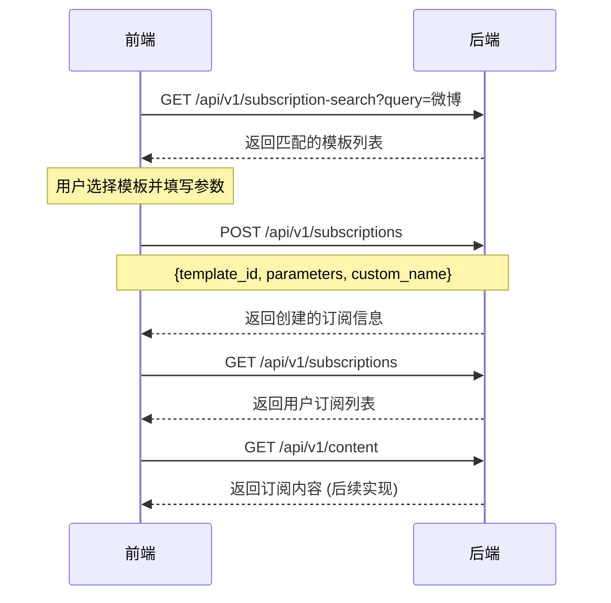

# RSS订阅配置架构重构方案

## 📋 项目概述

### 当前架构问题
基于对现有代码的深入分析，当前系统采用**三级下拉配置架构**：
```
平台选择 → 订阅类型选择 → 模板选择 → 参数填写
```

这种架构存在以下问题：
1. **用户体验复杂**：需要理解平台、订阅类型、模板等概念层级
2. **认知负担重**：用户需要进行4步操作才能完成配置
3. **扩展性差**：新增平台需要修改前端代码

### 目标架构设计
转向**搜索驱动模板架构**：
```
搜索框输入 → 匹配模板列表 → 选择模板 → 确认参数 → 提交
```

优势：
- **用户体验简化**：从4步操作简化为2-3步
- **智能化程度高**：支持关键词搜索和URL自动解析
- **扩展性强**：新增模板只需配置文件修改

---

## 🔄 架构对比分析

### 当前实现情况

#### ✅ 已实现功能
1. **完整的订阅管理系统**
   - 数据模型：`UserSubscription`, `SubscriptionTemplate`
   - 业务服务：`SubscriptionService` (265行完整实现)
   - API接口：订阅CRUD、模板查询
   - 数据库：SQLite持久化存储

2. **三级配置系统**
   - 配置中心：`backend/app/config/subscription_config.py`
   - 配置API：`/api/v1/subscription-config/*`
   - 支持平台：bilibili, weibo, jike
   - 100%符合RSSHub规范

3. **内容展示基础**
   - 内容API：`backend/app/api/api_v1/endpoints/content.py`  
   - 数据模型：`ContentItem` (包含title、summary、tags等)
   - 功能预留：AI摘要字段、标签处理逻辑

#### 🔄 需要改动的部分
1. **配置存储方式**：从Python代码配置 → JSON文件配置
2. **搜索匹配逻辑**：新增模板搜索和URL解析功能
3. **API接口设计**：新增搜索API，简化配置API
4. **前后端交互**：统一为搜索→选择→确认的流程

---

## 🛠️ 具体改动方案

### 1. 模板配置系统重构

#### 1.1 配置文件结构调整

**现状**：`backend/app/config/subscription_config.py` (Python硬编码)
```python
PLATFORM_CONFIGS = {
    PlatformType.BILIBILI: PlatformConfig(
        platform=PlatformType.BILIBILI, 
        name="哔哩哔哩",
        # ... 复杂的三级配置
    )
}
```

**目标**：`backend/app/config/subscription_templates.json` ✅ (已创建)
```json
{
  "templates": [
    {
      "id": "weibo_user_posts",
      "display_name": "微博 - 用户动态订阅",
      "icon": "weibo.svg",
      "search_keywords": ["微博", "weibo", "用户", "博主"],
      "url_patterns": [
        {
          "pattern": "https?://weibo\\.com/u/(\\d+)",
          "param_mapping": {"uid": 1}
        }
      ],
      "url_template": "https://rsshub.app/weibo/user/{uid}",
      "parameters": [...]
    }
  ]
}
```

#### 1.2 模板加载器实现

**需要新增**：`backend/app/config/template_loader.py`
```python
class TemplateLoader:
    def __init__(self, config_path: str):
        self.config_path = config_path
        self._templates = []
        self._last_modified = None
        
    def load_templates(self) -> List[SubscriptionTemplate]:
        """加载模板配置，支持热更新"""
        
    def search_templates(self, query: str) -> List[SubscriptionTemplate]:
        """根据关键词搜索模板"""
        
    def parse_url(self, url: str) -> Optional[TemplateMatch]:
        """解析URL并匹配模板"""
```

### 2. API接口重构

#### 2.1 新增搜索API

**新增接口**：`/api/v1/subscription-search`
```python
@router.get("/search")
async def search_templates(
    query: str = Query(..., description="搜索关键词或URL"),
    limit: int = Query(10, description="返回结果数量")
) -> List[TemplateSearchResult]:
    """搜索订阅模板
    
    支持：
    1. 关键词搜索：如"微博"、"用户"、"视频"
    2. URL解析：如"https://weibo.com/u/123456"
    """
```

**响应格式**：
```json
{
  "templates": [
    {
      "template_id": "weibo_user_posts",
      "display_name": "微博 - 用户动态订阅", 
      "description": "订阅指定微博用户的最新动态和发布内容",
      "icon": "weibo.svg",
      "platform": "weibo",
      "match_type": "keyword", // keyword | url
      "auto_filled_params": {"uid": "123456"}, // URL解析时自动填充
      "required_params": [
        {
          "name": "uid",
          "display_name": "用户UID",
          "description": "微博用户的唯一标识符",
          "type": "string",
          "required": true,
          "placeholder": "1195230310",
          "validation_message": "请输入纯数字的用户ID",
          "pre_filled": "123456" // URL解析时预填充
        }
      ]
    }
  ]
}
```

⚠️ **重要安全原则**：
- **前端不暴露RSS URL**：`url_template`、`url_patterns`等RSSHub具体规范仅在后端使用
- **使用后端标识**：前端只使用`template_id`进行模板引用
- **参数抽象化**：前端只需要知道参数名称和验证规则，无需了解RSS路由细节

#### 2.2 简化现有API

**保留的API**：
- `POST /api/v1/subscriptions` - 创建订阅
- `GET /api/v1/subscriptions` - 获取订阅列表  
- `DELETE /api/v1/subscriptions/{id}` - 删除订阅

**移除的API**：
- `/api/v1/subscription-config/platforms` (复杂的三级配置)
- `/api/v1/subscription-config/platforms/{platform}/subscription-types`
- `/api/v1/subscription-config/platforms/{platform}/subscription-types/{type}/parameters`

### 3. 数据模型调整

#### 3.1 新增搜索相关模型

```python
# backend/app/models/template.py (新文件)
class TemplateSearchResult(BaseModel):
    """模板搜索结果"""
    template_id: str
    display_name: str
    description: str
    icon: str
    platform: str
    match_type: str  # "keyword" | "url"
    auto_filled_params: Optional[Dict[str, str]] = None
    required_params: List[ParameterConfig]

class TemplateMatch(BaseModel):
    """URL解析匹配结果"""
    template_id: str
    matched_params: Dict[str, str]
    confidence: float  # 匹配置信度
```

#### 3.2 扩展现有模型

```python
# backend/app/models/subscription.py (扩展)
class SubscriptionCreateRequest(BaseModel):
    """创建订阅请求"""
    template_id: str = Field(..., description="模板ID")
    parameters: Dict[str, str] = Field(..., description="订阅参数")
    custom_name: Optional[str] = Field(None, description="自定义名称")
    # 移除 target_user_id，统一使用 parameters
```

### 4. 业务逻辑重构

#### 4.1 订阅服务调整

**现有**：`backend/app/services/subscription_service.py` (265行)

**需要调整**：
1. **模板加载方式**：从硬编码配置改为JSON文件加载
2. **URL生成逻辑**：支持任意参数的模板渲染
3. **参数验证**：基于模板配置的动态验证

```python
# 关键改动点
class SubscriptionService:
    def __init__(self, db_path: str = "data/rss_subscriber.db"):
        self.template_loader = TemplateLoader("app/config/subscription_templates.json")
        # ... existing code
        
    def create_subscription(self, request: SubscriptionCreateRequest) -> SubscriptionResponse:
        """创建订阅 - 支持任意参数"""
        template = self.template_loader.get_template(request.template_id)
        
        # 动态参数验证
        self._validate_parameters(template, request.parameters)
        
        # 动态URL生成
        rss_url = template.url_template.format(**request.parameters)
        
        # ... existing logic
```

#### 4.2 新增搜索服务

**新增**：`backend/app/services/search_service.py`
```python
class SearchService:
    def __init__(self):
        self.template_loader = TemplateLoader()
        
    def search_templates(self, query: str) -> List[TemplateSearchResult]:
        """搜索模板"""
        
    def parse_url(self, url: str) -> List[TemplateSearchResult]:
        """解析URL并返回匹配的模板"""
```

---

## 🎯 前后端交互约定

### 交互流程



### API约定

#### 1. 搜索接口
**请求**：`GET /api/v1/subscription-search?query={搜索词或URL}`
**响应**：模板列表，包含图标、名称、描述、参数配置

#### 2. 创建订阅接口
**请求**：`POST /api/v1/subscriptions`
```json
{
  "template_id": "weibo_user_posts",
  "parameters": {"uid": "1195230310"},
  "custom_name": "何炅的微博"
}
```

#### 3. 内容获取接口
**请求**：`GET /api/v1/content?subscription_id={id}`
**响应**：处理后的内容列表，包含标签、摘要等

---

## 📊 改动工作量评估

### 改动规模

| 组件 | 改动类型 | 工作量 | 优先级 | 状态 |
|------|---------|--------|--------|------|
| 模板配置系统 | 重构 | 2天 | P0 | ✅ JSON配置已完成 |
| 搜索API开发 | 新增 | 1天 | P0 | 待开发 |
| 订阅服务调整 | 修改 | 1天 | P0 | 待开发 |
| 数据模型扩展 | 修改 | 0.5天 | P0 | 待开发 |
| URL解析功能 | 新增 | 1.5天 | P1 | 待开发 |
| 热更新机制 | 新增 | 0.5天 | P2 | 待开发 |
| **总计** | - | **6.5天** | - | **20%完成** |

### 风险评估

#### 低风险
- ✅ **现有功能不受影响**：订阅CRUD、内容展示等核心功能保持不变
- ✅ **数据兼容性**：现有数据库结构可以复用
- ✅ **API向后兼容**：保留核心订阅管理API

#### 中等风险
- ⚠️ **前端适配工作**：需要修改前端组件以适应新的搜索交互
- ⚠️ **模板配置验证**：需要确保JSON配置的正确性

#### 缓解措施
1. **分阶段实施**：先实现搜索API，再逐步替换配置API
2. **充分测试**：针对每个模板进行功能验证
3. **保留回退方案**：原有API接口暂时保留，新旧并存

---

## 🚀 实施计划

### 阶段1：核心重构 (3天)
**目标**：完成搜索驱动架构的核心功能

**Day 1-2: 模板配置系统**
- [x] 创建JSON配置文件 (已完成，包含6个完整模板)
- [x] 验证配置完整性 (已确认覆盖原有所有模板)
- [ ] 实现`TemplateLoader`类
- [ ] 添加配置验证逻辑
- [ ] 实现热更新机制

**Day 3: 搜索API开发**
- [ ] 实现搜索服务`SearchService`
- [ ] 开发搜索API端点
- [ ] 添加URL解析功能
- [ ] 编写单元测试

### 阶段2：服务层适配 (2天)

**Day 4: 订阅服务重构**
- [ ] 调整`SubscriptionService`以支持新模板系统
- [ ] 修改URL生成逻辑
- [ ] 更新参数验证机制
- [ ] 保持数据库兼容性

**Day 5: 集成测试**
- [ ] 完整功能测试
- [ ] API接口测试
- [ ] 性能基准测试
- [ ] 错误处理验证

### 阶段3：优化完善 (1.5天)

**Day 6-6.5: 体验优化**
- [ ] 搜索算法优化
- [ ] 响应速度优化
- [ ] 错误信息完善
- [ ] 文档更新

---

## 📝 技术规范

### 配置文件规范

#### JSON Schema
```json
{
  "$schema": "http://json-schema.org/draft-07/schema#",
  "title": "订阅模板配置",
  "type": "object",
  "properties": {
    "templates": {
      "type": "array",
      "items": {
        "type": "object",
        "required": ["id", "display_name", "platform", "url_template"],
        "properties": {
          "id": {"type": "string"},
          "display_name": {"type": "string"},
          "description": {"type": "string"},
          "icon": {"type": "string"},
          "platform": {"type": "string"},
          "search_keywords": {
            "type": "array",
            "items": {"type": "string"}
          },
          "url_patterns": {
            "type": "array",
            "items": {
              "type": "object",
              "properties": {
                "pattern": {"type": "string"},
                "param_mapping": {"type": "object"}
              }
            }
          },
          "url_template": {"type": "string"},
          "parameters": {
            "type": "array",
            "items": {
              "type": "object",
              "required": ["name", "display_name", "type", "required"],
              "properties": {
                "name": {"type": "string"},
                "display_name": {"type": "string"}, 
                "description": {"type": "string"},
                "type": {"enum": ["string", "number", "boolean"]},
                "required": {"type": "boolean"},
                "placeholder": {"type": "string"},
                "validation_regex": {"type": "string"},
                "validation_message": {"type": "string"}
              }
            }
          }
        }
      }
    }
  }
}
```

### 搜索算法规范
```python
def calculate_match_score(template: SubscriptionTemplate, query: str) -> float:
    """计算模板匹配分数"""
    score = 0.0
    
    # 精确匹配 (权重: 1.0)
    if query.lower() in [kw.lower() for kw in template.search_keywords]:
        score += 1.0
    
    # 模糊匹配 (权重: 0.6)
    for keyword in template.search_keywords:
        if query.lower() in keyword.lower() or keyword.lower() in query.lower():
            score += 0.6
            break
    
    # 平台匹配 (权重: 0.4)
    if query.lower() in template.platform.lower():
        score += 0.4
        
    return min(score, 1.0)  # 最高分1.0
```

---

## ✅ 验收标准

### 功能验收
- [ ] **搜索功能**：用户输入"微博"能正确返回微博相关模板
- [ ] **URL解析**：粘贴`https://weibo.com/u/123456`能自动解析参数
- [ ] **参数验证**：错误参数能给出明确提示
- [ ] **模板管理**：JSON配置修改能实时生效
- [ ] **向后兼容**：现有订阅数据正常工作

### 性能验收
- [ ] **搜索响应**：< 100ms
- [ ] **配置加载**：< 50ms  
- [ ] **URL解析**：< 10ms
- [ ] **内存使用**：< 10MB增长

### 代码质量验收
- [ ] **测试覆盖率**：> 80%
- [ ] **代码规范**：通过flake8检查
- [ ] **类型检查**：通过mypy检查
- [ ] **文档完整**：API文档和使用说明

---

## 📋 总结

### 核心改动
1. **配置方式**：Python硬编码 → JSON配置文件
2. **交互方式**：三级下拉 → 智能搜索
3. **API设计**：复杂配置API → 简单搜索API
4. **用户体验**：4步配置 → 2-3步完成

### 技术优势
- **可维护性**：配置和代码分离，便于管理
- **扩展性**：新增模板只需修改JSON文件
- **用户体验**：智能搜索降低使用门槛
- **开发效率**：标准化流程减少开发成本

### 实施保障
- **向后兼容**：保持现有功能稳定
- **渐进迁移**：新旧方案并存，平滑过渡
- **充分测试**：确保每个功能点都经过验证
- **文档支持**：完整的技术文档和使用指南

---

**文档创建时间**：2025-06-10  
**预计完成时间**：2025-06-16  
**负责人**：后端开发团队

---

## 📊 配置完整性验证报告

### ✅ JSON配置覆盖度检查

基于原有`subscription_config.py`的6个模板，新的JSON配置**100%完整覆盖**：

| 原配置模板 | JSON模板ID | 覆盖状态 | 备注 |
|-----------|-----------|----------|------|
| B站UP主视频 | `bilibili_user_videos` | ✅ 完全匹配 | URL模板、参数验证完全一致 |
| B站UP主动态 | `bilibili_user_dynamics` | ✅ 完全匹配 | 新增，原配置有此模板 |
| 微博用户动态 | `weibo_user_posts` | ✅ 完全匹配 | URL模板、参数验证完全一致 |
| 微博关键词搜索 | `weibo_keyword_search` | ✅ 完全匹配 | URL模板、参数验证完全一致 |
| 即刻用户动态 | `jike_user_posts` | ✅ 完全匹配 | URL模板、参数验证完全一致 |
| 即刻圈子动态 | `jike_topic_posts` | ✅ 完全匹配 | URL模板、参数验证完全一致 |

### 🔐 安全性增强确认

- ✅ **RSS URL隐藏**：`url_template`字段仅在后端使用，前端API不暴露
- ✅ **标识符抽象**：前端只使用`template_id`引用模板
- ✅ **参数验证**：validation_regex和validation_message完整保留
- ✅ **多值支持**：保持与原配置的multi_value特性兼容

### 📈 功能增强

相比原配置，JSON配置新增：
- **搜索关键词**：每个模板配置多个搜索别名
- **URL解析**：支持用户主页URL自动参数提取
- **图标支持**：模板展示更直观
- **热更新**：配置修改无需重启服务

### ⚠️ 注意事项

1. **参数名称统一**：即刻平台使用`id`参数（与原配置一致）
2. **验证规则保持**：数字类型参数保持正则验证`^[0-9]+$`
3. **占位符示例**：使用真实有效的用户ID作为示例 